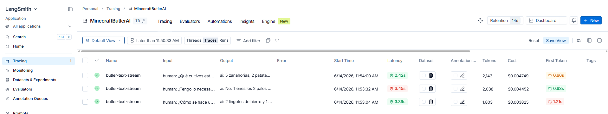
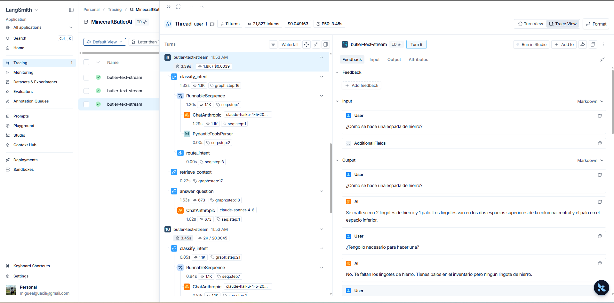
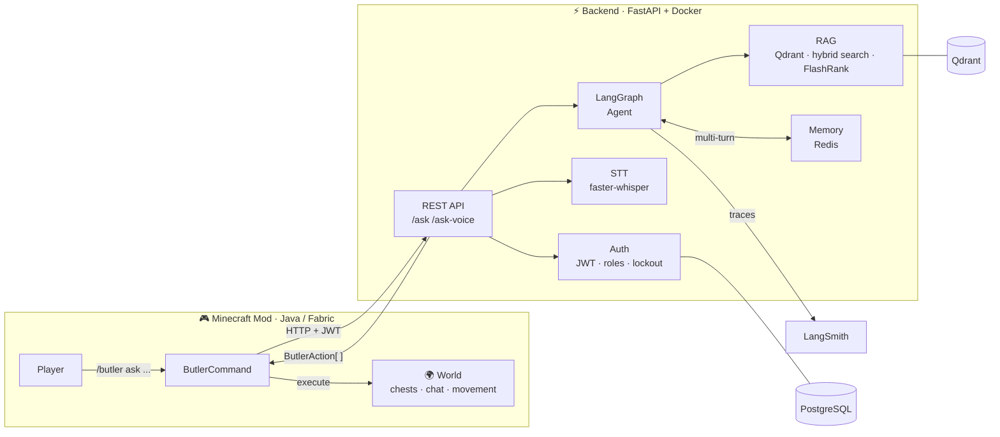

# MinecraftButlerAI: Backend

> Alfred, your AI butler inside Minecraft. Speak or type a command and he manages your chests,
> moves to positions, responds in chat, driven by a LangGraph agent with RAG and conversation memory.


## Demo

https://github.com/user-attachments/assets/6c864b80-22f0-4b93-9eac-2a33d847edb2

Three questions in a single session, each exercising a different capability:

| # | Question | Alfred's answer | Powered by |
|---|---|---|---|
| 1 | *¿Cómo se hace una espada de hierro?* | 2 lingotes de hierro y 1 palo | **RAG** over the Minecraft Wiki |
| 2 | *¿Tengo lo necesario para fabricarla?* | No, te faltan los lingotes de hierro (tienes palos, pero ningún lingote) | **Memory + live world state** |
| 3 | *¿Qué cultivos están listos para recoger?* | 5 zanahorias, 2 patatas... | **Live world state** |

Question 2 is the interesting one: Alfred recalls the previous answer (the sword recipe) and cross-checks it against the player's actual inventory. Memory and world context working together.

### Under the hood (LangSmith)

Every turn is fully traced. Each message flows through a LangGraph pipeline
(`classify_intent` → `route_intent` → `retrieve_context` → `answer_question`), using a
cheap model (`claude-haiku-4-5`) for intent classification and a stronger one
(`claude-sonnet-4-6`) for the final answer.


*The three turns with latency, time-to-first-token, token usage and cost. Around $0.004 and 2.4 to 3.5s per turn.*


*Full trace for question 1: intent classification, routing, RAG retrieval and answer generation.*

## Architecture



The backend is the brain: the Minecraft mod ([minecraft-butler-ai-mod](https://github.com/migue0418/minecraft-butler-ai-mod)) acts as a thin HTTP client that sends player messages and executes the structured actions Alfred decides to take.

## What makes this interesting

- **LangGraph agent**: multi-step reasoning graph that plans, retrieves context, and selects the right action
- **RAG pipeline**: ~1,665 Minecraft Wiki documents (items, mobs, mechanics) indexed in Qdrant with hybrid search (dense + sparse) and FlashRank reranker
- **Voice input (STT)**: `faster-whisper` transcribes audio directly, enabling hands-free in-game commands
- **Conversation memory**: Redis checkpointer via LangGraph keeps multi-turn context across requests
- **LangSmith tracing**: full observability over every agent step, token usage, and retrieval quality
- **Auth system**: JWT access/refresh tokens, role-based access control, account lockout, argon2 password hashing

## Stack

| Layer | Tech |
|---|---|
| API | FastAPI · SQLAlchemy async · Alembic · PostgreSQL |
| Auth | JWT (15 min) + refresh token (HTTP-only cookie) · argon2 · SlowAPI |
| Agent | LangGraph · LangChain · Claude (Anthropic) |
| Retrieval | Qdrant · hybrid search · FlashRank reranker |
| Voice | faster-whisper (STT) |
| Memory | Redis (LangGraph checkpointer) |
| Observability | LangSmith |
| Packaging | uv · Docker Compose |

## Quick start (Docker)

```bash
cp .example.env .env   # fill in ANTHROPIC_API_KEY and other vars
docker compose up --build
```

API docs at `http://localhost:8000/api/documentation`
Default credentials: `admin` / `ChangeMe123!`

### Ingest Minecraft knowledge (RAG)

Run once after the services are up to populate Qdrant:

```bash
uv run python scripts/ingest.py
```

Downloads ~1,665 documents from the Minecraft Wiki and indexes them into Qdrant.
Use `--force` to re-index if you change the embedding model.

## Local development

Requires [uv](https://docs.astral.sh/uv/), PostgreSQL, and Qdrant.

```bash
docker compose up -d qdrant redis db

uv sync
uv run python scripts/ingest.py   # first time only
uv run uvicorn app.main:app --reload
```

## Tests

```bash
uv run pytest -q
```

Requires PostgreSQL at `127.0.0.1:5432`. Adjust `TEST_DATABASE_ADMIN_URL` in `.env` if needed.

## Project structure

```
app/
├── core/          # settings, DB, lifespan, rate limiter, migrations
└── features/
    ├── auth/      # JWT, refresh tokens, lockout, sessions
    ├── users/     # account management
    ├── roles/     # role-based access control
    ├── health/    # health check
    └── butler/    # LangGraph agent -> Minecraft actions
```

Slice architecture: each feature owns its `router.py`, `schemas.py`, `service.py`, `repository.py`, and `models.py`.

## Key environment variables

| Variable | Description |
|---|---|
| `ANTHROPIC_API_KEY` | Required - Claude API key |
| `SECRET_KEY` | JWT signing key (32+ chars in production) |
| `DATABASE_URL` | PostgreSQL connection string |
| `LANGSMITH_API_KEY` | Optional - LangSmith tracing |
| `LANGCHAIN_TRACING_V2` | `true` to enable LangSmith |

See `.example.env` for the full list.

## Companion repo

[minecraft-butler-ai-mod](https://github.com/migue0418/minecraft-butler-ai-mod) - Fabric mod (Java), the in-game client that talks to this API.
